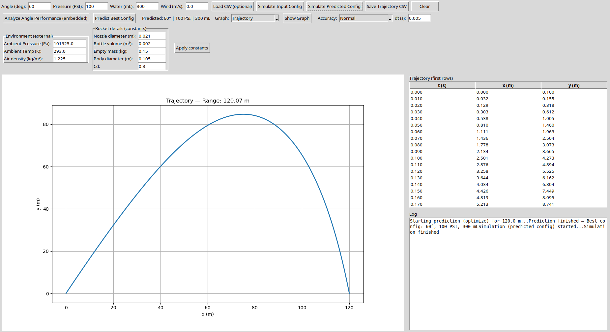
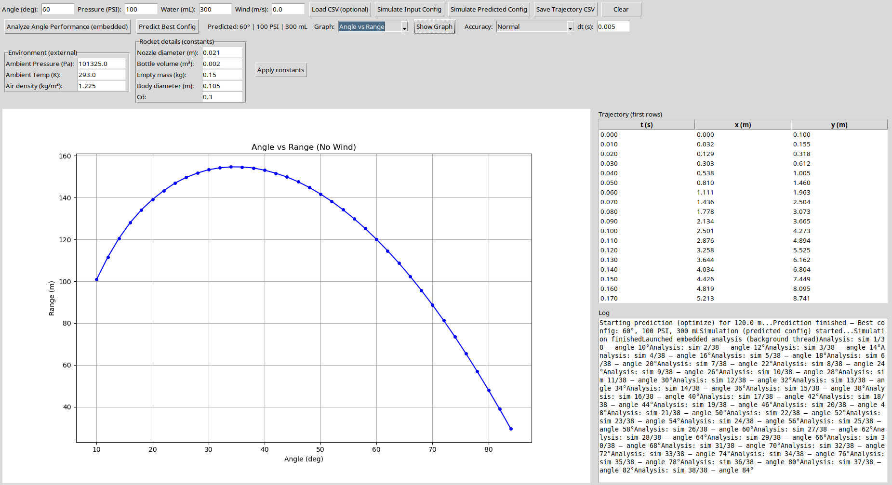

# Water‑Rocket‑Flight‑Simulation 🚀

A high‑accuracy Python water‑rocket flight simulator with optimization, full physics engine, Tkinter GUI, trajectory visualization, angle–pressure sweep analysis, and configurable rocket/environment parameters — designed for rocketry competitions, undergraduate research, and practical avionics experimentation.

---

## ✨ Features

### 🔧 Physics Engine
- Realistic thrust modeling: water phase + compressed‑air phase  
- Variable internal pressure (adiabatic expansion)  
- Drag force using rocket cross‑section area & drag coefficient  
- Mass variation as water/air exhaust  
- Optional wind effects on trajectory  

### 📐 Configurable Rocket & Environment
Via GUI you can set:  
- Ambient pressure, temperature, air density  
- Bottle volume, nozzle diameter, rocket body diameter, empty mass, drag coefficient  
- Wind speed  


Constants are applied globally — convenient for comparing different bottle designs or atmospheric conditions.

### 🖥️ GUI Interface (Tkinter + Matplotlib)
- Embedded real‑time trajectory plot  
- Table view of simulation data (time, position)  
- Log console for progress, analysis & optimizer messages  
- Graph selector:  
  - Trajectory  
  - Angle vs Range  
  - Wind‑Drift vs Range  
  - Max Altitude vs Launch Angle  

### 🎯 Optimization Mode
Enter a **target distance (m)** ➝ brute‑force search over launch parameters:  
- Launch angle  
- Initial pressure (PSI)  
- Water volume (mL)

Automatically returns best configuration and displays trajectory.


### 🧪 High‑Accuracy Mode
Choose between:  
- **Normal mode** — original integrator (fast)  
- **High‑accuracy mode** — RK4 integrator with user‑controlled time-step for more precise simulation  

### 📄 CSV Import / Export
- Load external trajectory data (CSV)  
- Save simulated trajectories to CSV for post‑processing  

---

## 🛠️ Installation & Setup

```bash
git clone https://github.com/Voyager‑Space/Water‑Rocket‑Flight‑Simulation.git
cd Water‑Rocket‑Flight‑Simulation
pip install numpy pandas matplotlib
```

> Tkinter comes bundled with standard Python installations (Windows / Linux / macOS).  
> No additional GUI libraries needed.

---

## ▶️ Running the Application

```bash
python simulation_gui.py
```

This will launch the Tkinter GUI, where you can configure rocket/atmosphere params, run simulations, optimize launch, and export results.

---

## 📚 How It Works – Under the Hood

1. **Physics model** computes thrust from pressurized water/air, drag, gravity, and changing mass due to ejected water/air.  
2. **Numerical integration**: RK4 (4th‑order Runge–Kutta), optionally at a refined time-step for higher fidelity.  
3. **Optimization engine** does a brute‑force grid search over angle/pressure/water to match desired target distance.  
4. **Visualization & data handling** via embedded Matplotlib plots and CSV export for post-analysis.

---
## 🔭 Future Enhancements

- Real‑time animated flight visualization  
- Monte Carlo simulations for wind / parameter uncertainty  
- Support for different rocket geometries  
- Parallelized optimizer (multiprocessing)  
- Export plots as PNG / PDF

---

## ✅ License

This project is open‑source under the **MIT License**. See `LICENSE` for details.

---

## 🙌 Contributions & Feedback

Pull‑requests, bug reports, and feature suggestions are most welcome!  
Feel free to open an issue or connect if you're working on rocketry or simulation research.
